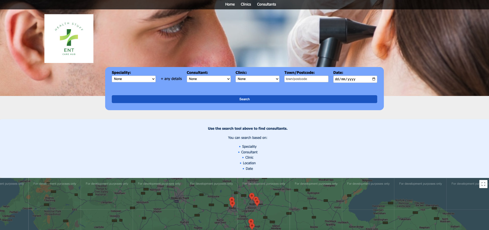
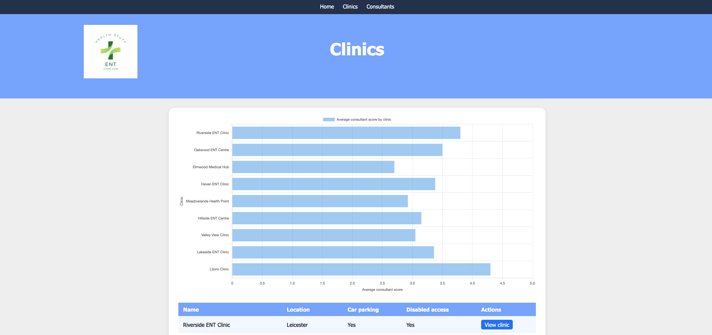

# ENT Clinic Website (PHP)

## Overview
This project is a **website for an ENT (Ear, Nose, and Throat) clinic** built using PHP.  
It demonstrates the clinic’s profile, consultants, schedules, results, and other related information.  

**Note:**  
- This repository is for **viewing purposes only**.  
- The site will not function fully because it depends on a **private MySQL server** that is not included here.  

## Project Structure
```
project-root/
│── clinics.php
│── clinicsProfile.php
│── consProfile.php
│── consSchedule.php
│── consultants.php
│── enthub.php
│── results.php
│── README.md
│── images/              # Uploaded here, but should be placed in project root
```

## Images
- All images currently inside the `images/` folder must be moved to the **project root** for the site to display correctly.  
- For example:  
  ```
  project-root/
  │── blank-profile-picture-973460_960_720.webp
  │── clinics.php
  │── ...
  ```

## Requirements
- PHP 7.4+  
- A local or hosted web server (e.g., Apache with XAMPP, WAMP, or LAMP)  
- MySQL (not included, private server only)  

## How to View
1. Download/clone this repository.  
2. Place the files in your web server’s root directory (e.g., `htdocs` for XAMPP).  
3. Move the contents of the `images/` folder to the **project root**.  
4. Open the site in your browser at:
   ```
   http://localhost/your-folder-name/
   ```
   *(The dynamic features will not work since the MySQL backend is private.)*





## Features
- Clinic profiles  
- Consultant information  
- Scheduling system  
- Results display (non-functional without database)  

## License
This project is provided as-is, for educational and demonstration purposes only.
